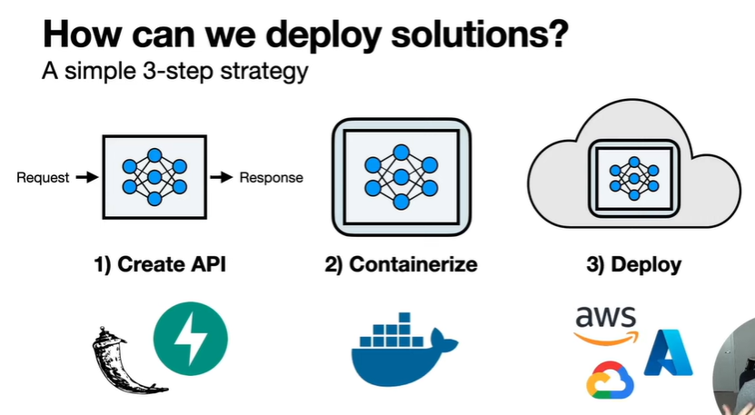

## FUll Stack Data Science Project.

### Build a sementic you tube video search application and deploy it.

### Technologies

- Yuotube transcript api
- sentence transforms
- sementic search techniques
- Fast API
- Docker
- AWS

### 4 hats in data science

- Project Manager: Planning, Scope, Managing Resources...(In PM framework, There are 5 main steps...)
- Data Engineer: Buolding data available for analytics and ML application
- - Dta Pipeline (Extract, Transform, Load) , 2 techniques -> ETL and ELT
- Data Scientist:
- ML Engineer:

### After create the model, 3 things to do.

1. create API : API wrap the model
2. Containerized
3. Deploy

### 4 main steps

1. Create search API with FastAPI : uvicorn main:app --reload
2. Create Docker image for API : semantic-search-api

- docker build -t semantic-search-api .
- docker run -d --name semantic-search-container -p 80:80 semantic-search-api

3. Push image to Docker Hub : youtube-semantic-search-app

- create a repo
- docker tag semantic-search-api udaradoc/youtube-semantic-search-app (repo will add to images in docker desktop)
- docker push udaradoc/youtube-semantic-search-app:latest

4. Deploy container on AWS ECS(elastic container service):

- create an account
- search "ecs-elastic container service"
- Goto task definition
- create new task definition
- give a name = youtube-search-demo, os="linux...", RAM, task role = none
- fill container details(below part of above..)
- give a name=youtube-search-container-demo, image url from docker hub=udaradoc/youtube-semantic-search-app:latest, other options if needed.
- create

---

- goto culters
- create new cluster = youtube-search-cluster-demo. (there weresome errors while creating clusters. but however i fixed it.)
- inside cluster, create a service.(fill parts in "create service", select "launch type", create)
- onece it failed wile creating, created a service again.
